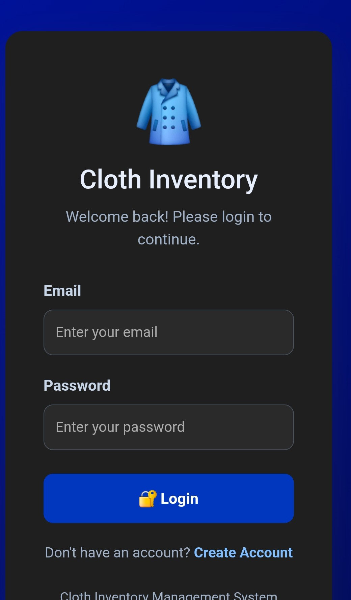
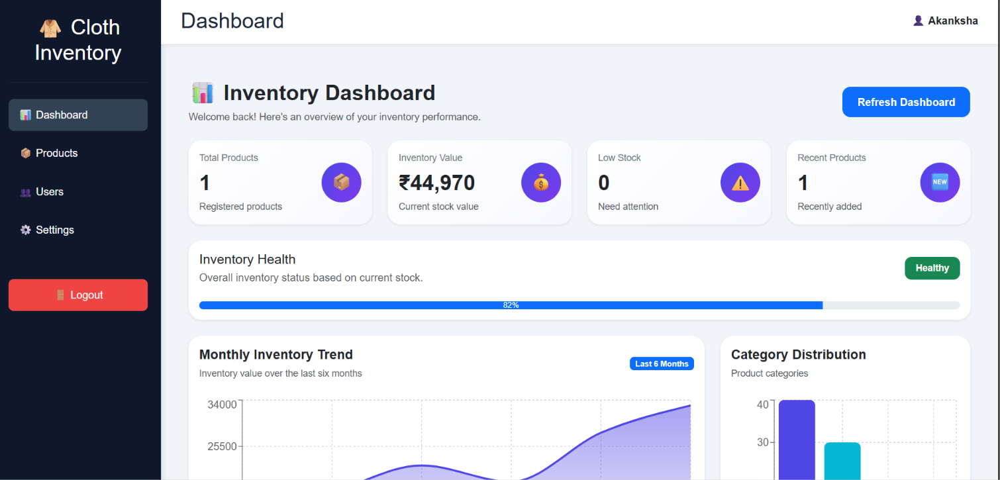
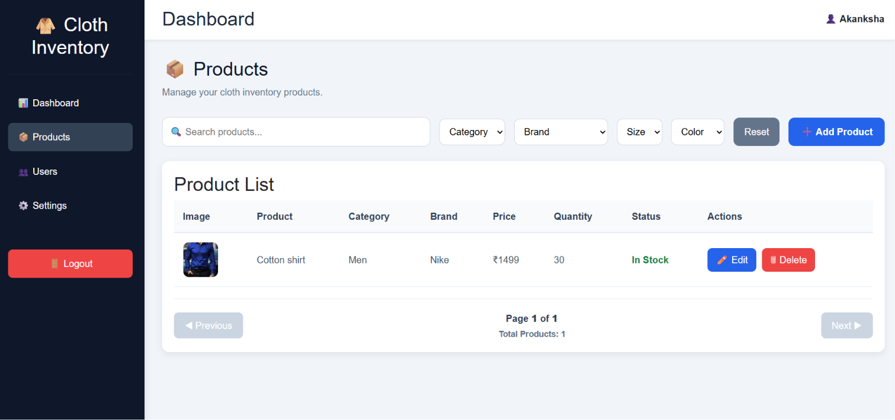
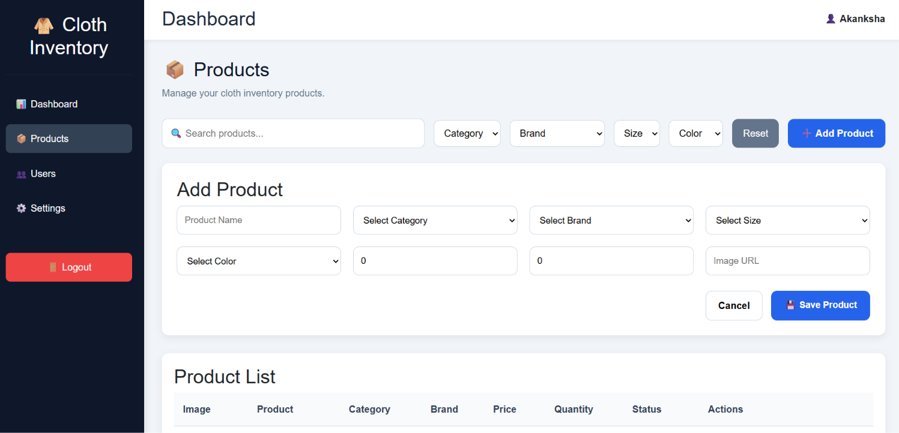
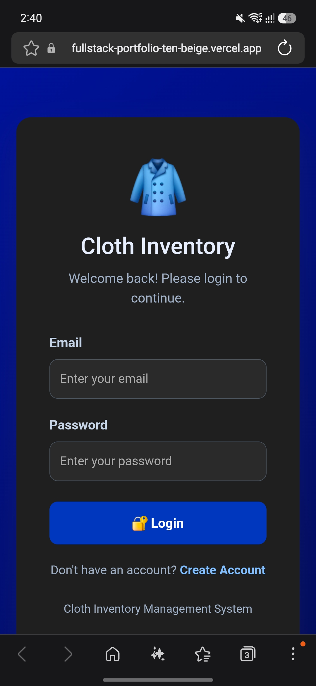

# 🛍️ Cloth Inventory Management System

<p align="center">

Full Stack Inventory Management System built using <b>FastAPI</b>, <b>React + TypeScript</b>, and <b>PostgreSQL</b>.

Designed with a modern architecture, secure authentication, responsive UI, and production-ready deployment.

</p>

---

## 📌 Project Overview

The Cloth Inventory Management System is a modern full-stack web application developed to simplify inventory management for clothing businesses.

The application enables users to securely manage products, monitor inventory, upload product images, search products efficiently, and analyze inventory through an interactive dashboard.

The project follows industry-standard software architecture using FastAPI for backend services, React + TypeScript for frontend development, PostgreSQL as the database, and Docker for containerization.

---

# ✨ Key Features

✅ JWT Authentication

✅ Role-Based Authorization

✅ Product CRUD Operations

✅ Dashboard Analytics

✅ Search Products

✅ Filter Products

✅ Pagination

✅ Image Upload

✅ Responsive Design

✅ Docker Support

✅ Cloud Deployment (Vercel + Render)

---

# 🛠 Tech Stack

## Frontend

- React
- TypeScript
- Bootstrap
- Axios
- React Router DOM

## Backend

- FastAPI
- SQLAlchemy
- Pydantic
- JWT Authentication

## Database

- PostgreSQL

## DevOps

- Docker
- Git
- GitHub
- Vercel
- Render

---

# 🌐 Live Demo

| Application | URL |
|-------------|-----|
| 🎨 Frontend | https://fullstack-portfolio-ten-beige.vercel.app |
| ⚙️ Backend API | https://fullstack-portfolio-1-q26k.onrender.com |
---

# 📂 Project Structure

```text
cloth-inventory/
│
├── backend/
│   ├── app/
│   ├── api/
│   ├── core/
│   ├── db/
│   ├── models/
│   ├── repositories/
│   ├── schemas/
│   ├── services/
│   └── main.py
│
├── frontend/
│   ├── src/
│   ├── api/
│   ├── components/
│   ├── layouts/
│   ├── pages/
│   ├── routes/
│   ├── types/
│   └── utils/
│
├── docker-compose.yml
├── Dockerfile
├── README.md
└── nginx/
```

---

# 🏗️ System Architecture

```text
                 User
                   │
                   ▼
       React + TypeScript Frontend
                   │
            JWT Authentication
                   │
                   ▼
            FastAPI REST APIs
                   │
         SQLAlchemy Repository
                   │
              PostgreSQL DB
```
---

# ⚙️ Installation

## Clone Repository

```bash
git clone https://github.com/akankshaakhaire-cloud/fullstack-portfolio.git
```

## Backend Setup

```bash
cd backend

python -m venv venv

# Windows
venv\Scripts\activate

# Linux / Mac
source venv/bin/activate

pip install -r requirements.txt

uvicorn app.main:app --reload
```

## Frontend Setup

```bash
cd frontend

npm install

npm run dev
```

---

# 🐳 Docker

Run the application using Docker Compose.

```bash
docker compose up --build
```

---

# 📡 API Endpoints

## Authentication

| Method | Endpoint |
|--------|----------|
| POST | /users/register |
| POST | /users/login |
| GET | /users/me |

---

## Products

| Method | Endpoint |
|--------|----------|
| GET | /products |
| GET | /products/{id} |
| POST | /products |
| PUT | /products/{id} |
| DELETE | /products/{id} |

---

## Dashboard

| Method | Endpoint |
|--------|----------|
| GET | /dashboard/stats |

---

# 📱 Responsive Design

✔ Desktop

✔ Tablet

✔ Mobile

---

# 🚀 Deployment

| Service | Platform |
|---------|----------|
| Frontend | Vercel |
| Backend | Render |
| Database | PostgreSQL |

---

# 📈 Future Enhancements

- Barcode Scanner
- Supplier Management
- Sales Reports
- Email Notifications
- Dark Mode
- Export Reports

---

# 👩‍💻 Developer

**Akanksha Khaire**

Senior Python Full Stack Developer

GitHub:
https://github.com/akankshaakhaire-cloud

---

---

# 📸 Application Screenshots

## 🔐 Login Page



## 📊 Dashboard



## 📦 Products



## ➕ Add Product



## 📱 Mobile View

---

# 📄 License

This project is intended for learning, portfolio, and demonstration purposes.
---
